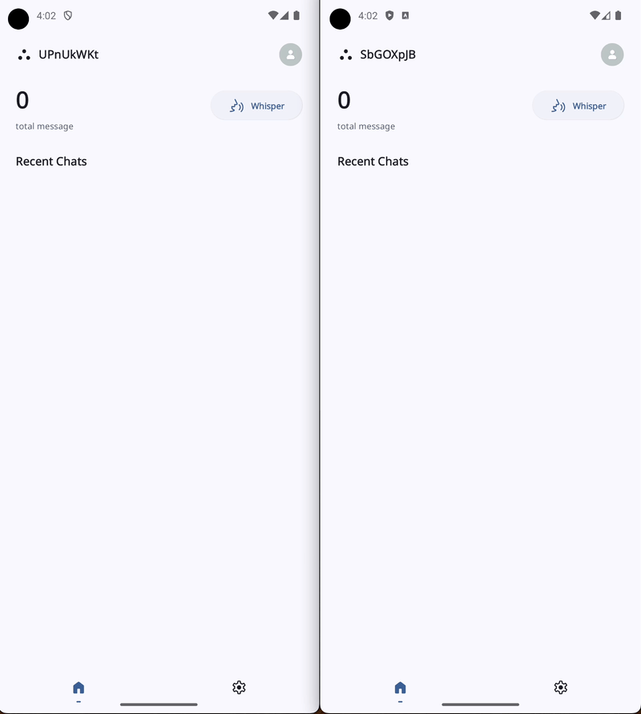
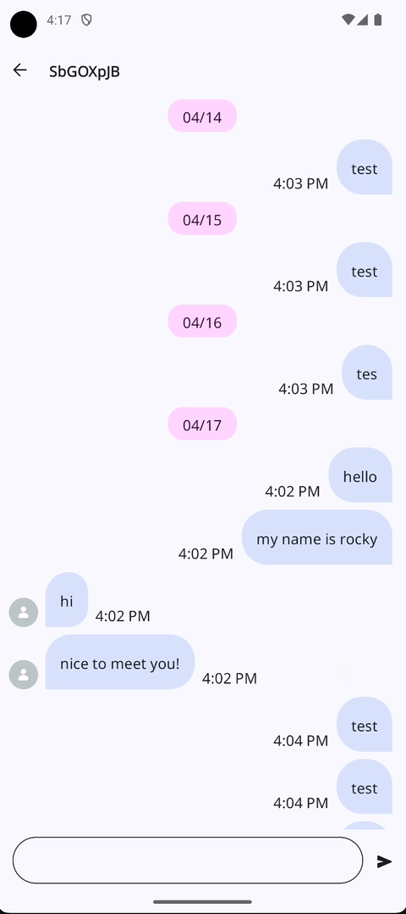
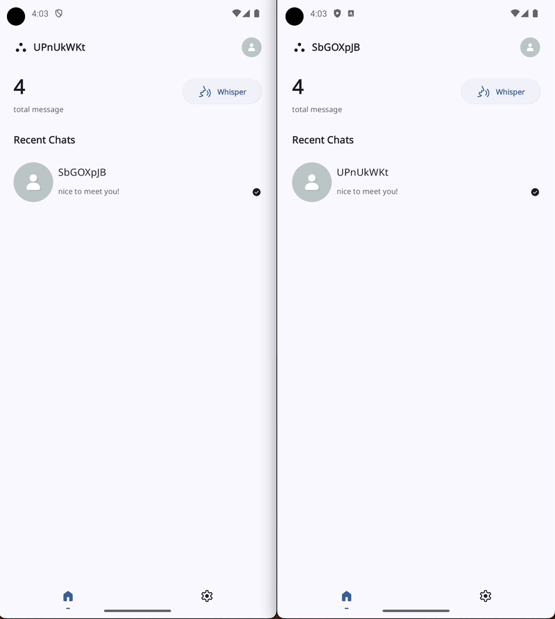
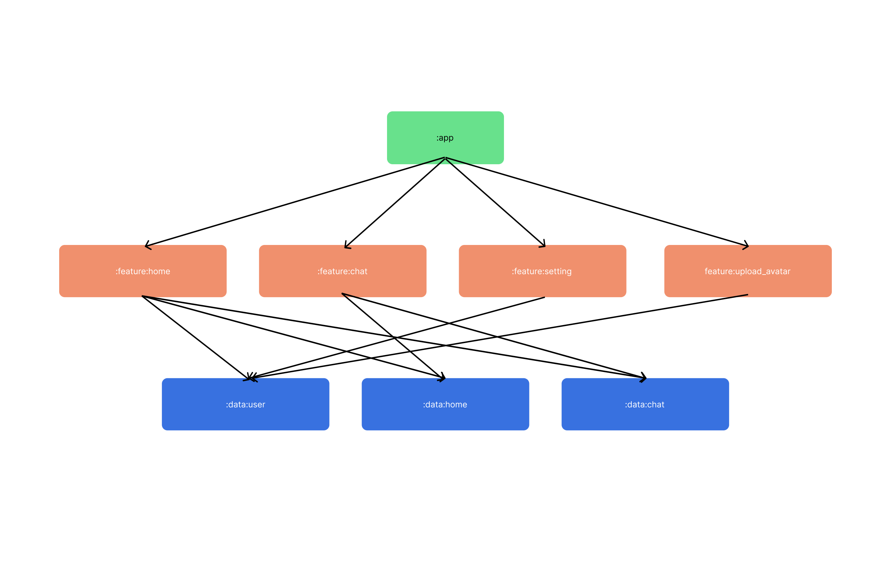

# Whisper

Whisper is building with MVI architecture with Jetpack Compose.

## Feature

**Whisper** use firebase to connect two users with uuid. User can send message to another user.

### Real-time chat

### Sticky header and save state

### Crop image and Upload to Firebase

## Architecture

## Build

Put your own `google-services.json` in `app` folder, then build the project.

## Testing (WIP)