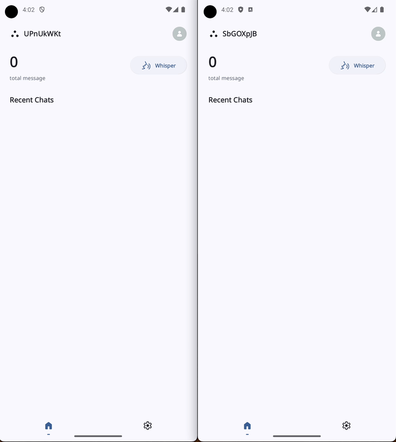
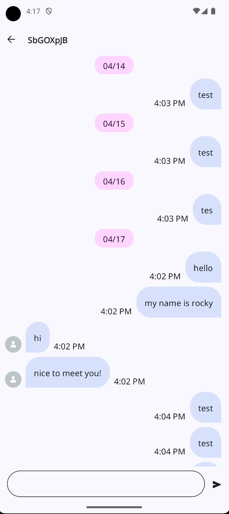
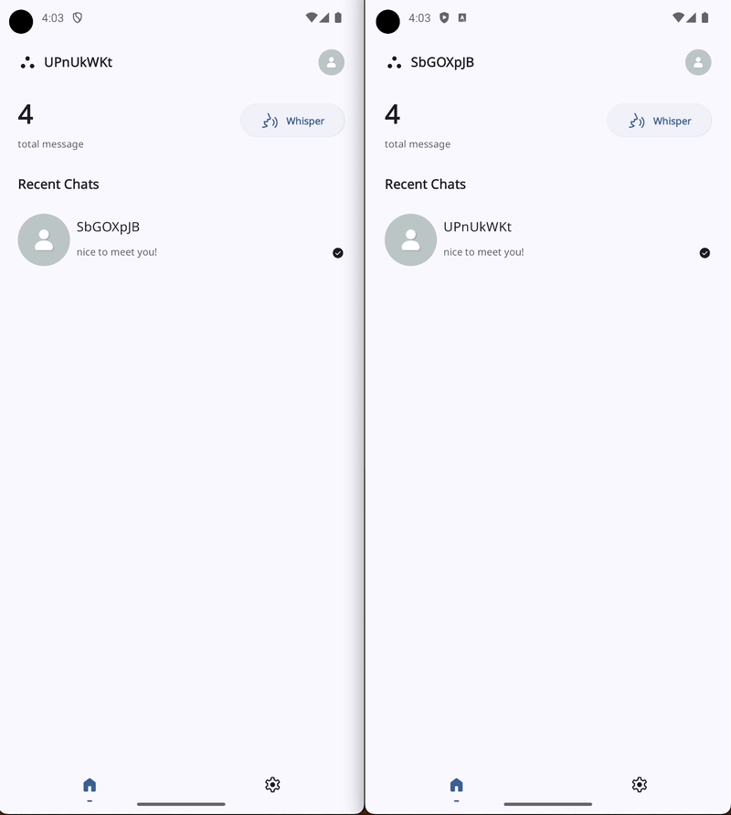

# Whisper

This app is a playground for practice mvi architecture with Jetpack Compose.

## Feature

**Whisper** use firebase to connect two users with uuid. User can send message to another user.

### Real-time chat

### Sticky Header

### Crop image and Upload to Firebase

## Architecture (WIP)