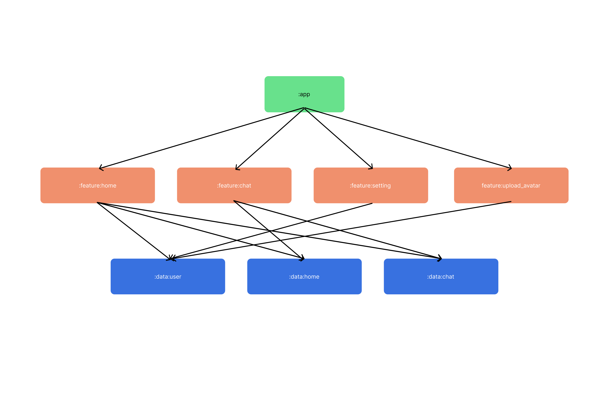

# Whisper

Whisper is building with MVI architecture with Jetpack Compose.

## Feature

**Whisper** use firebase to connect two users with uuid. User can send message to another user.

### Real-time chat

### Sticky header and save state

### Crop image and Upload to Firebase

## Structure

## Build

Put your own `google-services.json` in `app` folder, then build the project.

## Testing (WIP)

## Tech Stack

- [Jetpack Compose](https://developer.android.com/jetpack/compose)
- [Firebase](https://firebase.google.com/)
- [Hilt](https://developer.android.com/training/dependency-injection/hilt-android)
- [Coroutines](https://developer.android.com/kotlin/coroutines)
- [Room](https://developer.android.com/jetpack/androidx/releases/room)
- [Retrofit](https://square.github.io/retrofit/)